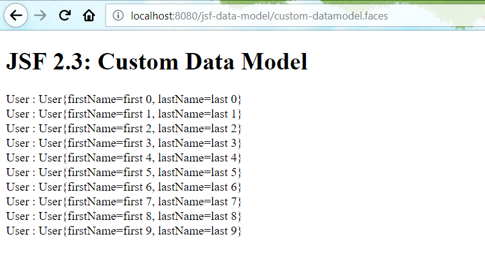

# UIData improvements

In JSF 2.3, `<h:dataTable/>` and `<ui:repeat />` support `Iterable` and `Map`.

## Iterable example

Let's create a simple demo to try it.

The backing bean.

```java
@Model
public class IterableBean {

    @Inject Logger LOG;

    private Iterable data = Arrays.asList("javaee 8", "jsf 2.3");

    public Iterable getData() {
        LOG.log(Level.INFO, "called IterableBean.getData");
        return data;
    }

}
```

And the facelets template.

```markup
<!DOCTYPE html>
<html lang="en" 
      xmlns="http://www.w3.org/1999/xhtml"
      xmlns:ui="http://xmlns.jcp.org/jsf/facelets"
      xmlns:f="http://xmlns.jcp.org/jsf/core"
      xmlns:h="http://xmlns.jcp.org/jsf/html"
      >
    <f:view>
        <h:head>
            <title>JSF 2.3: DataModel Sample</title>
        </h:head>
        <h:body>
            <h1>JSF 2.3: Iterable interface Sample</h1>

            <h2> h:dataTable Iterable interface</h2>
            <h:dataTable var="entry" value="#{iterableBean.data}">
                <h:column>#{entry}</h:column>
            </h:dataTable>
            <h2> ui:repeat Iterable interface</h2>
            <ui:repeat var="item" value="#{iterableBean.data}">
                Item: #{item}
            </ui:repeat>
        </h:body> 
    </f:view>
</html>
```

## Map example

The backing bean.

```java
@Model
public class MapBean {

    @Inject
    Logger LOG;

    private Map<Integer, String> data = new HashMap<>();

    public Map<Integer, String> getData() {
        LOG.log(Level.INFO, "called MapBean.getData");
        data.put(1, "java ee 8");
        data.put(2, "jsf 2.3");
        return data;
    }

}
```

And the facelets template.

```markup
<!DOCTYPE html>
<html lang="en" 
      xmlns="http://www.w3.org/1999/xhtml"
      xmlns:ui="http://xmlns.jcp.org/jsf/facelets"
      xmlns:f="http://xmlns.jcp.org/jsf/core"
      xmlns:h="http://xmlns.jcp.org/jsf/html"
      >
    <f:view>
        <h:head>
            <title>JSF 2.3: DataModel Sample</title>
        </h:head>
        <h:body>
            <h1>JSF 2.3:Map interface Sample</h1>

            <h2> UIRepeat: Map interface</h2>
            <ui:repeat var="entry" value="#{mapBean.data}">
                Key: #{entry.key}
                Value: #{entry.value}
            </ui:repeat>

            <h2>DataTable: Map Interface</h2>
            <h:dataTable var="entry" value="#{mapBean.data}">
                <h:column>#{entry.key}</h:column>
                <h:column>#{entry.value}</h:column>
            </h:dataTable>
        </h:body> 
    </f:view>
</html>
```

## Iteration without backing data

In former versions, when you want to iterate a number collection from 0 to 10, you have to use `c:forEach` which from legacy JSP taglibs.

Now the new `ui:repeat` added this feature finally.

```markup
<ui:repeat begin="0" end="10" step="2" var="i">
    #{i}<br />
</ui:repeat>
```

## Custom DataModel

JSF 2.3 provides a new `@FacesDataModel` to simplify the customization of your own `DataModel`.

The backing bean.

```java
@Model
public class CustomBean {

    @Inject
    Logger LOG;

    public UserData getUserData() {
        LOG.log(Level.INFO, "called CustomBean.getUserData");

        List<User> data = IntStream.of(0, 1, 2, 3, 4, 5, 6, 7, 8, 9)
                .mapToObj(i -> new User("first " + i, "last " + i))
                .collect(Collectors.toList());

        return new UserData(data);
    }

}
```

`UserData` is just a POJO which wraps a list of `User`.

```java
public class UserData {
    List<User> users = new ArrayList<>();

    public UserData() {
    }

    public UserData(List<User> users) {
        this.users = users;
    }

    public List<User> getUsers() {
        return users;
    }

    public void setUsers(List<User> users) {
        this.users = users;
    }

}
```

```java
public class User implements Serializable {

    private String firstName;
    private String lastName;

    public User(String firstName, String lastName) {
        this.firstName = firstName;
        this.lastName = lastName;
    }

    public String getFirstName() {
        return firstName;
    }

    public void setFirstName(String firstName) {
        this.firstName = firstName;
    }

    public String getLastName() {
        return lastName;
    }

    public void setLastName(String lastName) {
        this.lastName = lastName;
    }

    @Override
    public String toString() {
        return "User{" + "firstName=" + firstName + ", lastName=" + lastName + '}';
    }

}
```

The facelets template.

```markup
<ui:repeat value="#{customBean.userData}" var="item">
    User : #{item}<br />
</ui:repeat>
```

We use `UserData` as `UIRepeat` backing data, it is not supported in JSF by default. Let's fill the gap via custom `@FacesDataModel` class.

```java
@FacesDataModel(forClass = UserData.class)
public class UserDataModel extends DataModel<User> {

    UserData data = null;
    int index = 0;

    public UserDataModel() {
        this(null);
    }

    public UserDataModel(UserData data) {
        this.data = data;
    }

    @Override
    public boolean isRowAvailable() {
        return this.index >= 0 && this.index < this.getRowCount();
    }

    @Override
    public int getRowCount() {
        return this.data != null ? this.data.getUsers().size() : 0;
    }

    @Override
    public User getRowData() {
        if (this.index >= 0 && this.index < this.getRowCount()) {
            return this.data.getUsers().get(this.index);
        }

        return null;
    }

    @Override
    public int getRowIndex() {
        return this.index;
    }

    @Override
    public void setRowIndex(int rowIndex) {
        this.index = rowIndex;
    }

    @Override
    public Object getWrappedData() {
        return this.data;
    }

    @Override
    public void setWrappedData(Object data) {
        this.data = (UserData) data;
    }

}
```

Run this application on Glassfish, open your browser and navigate to [http://localhost:8080/jsf-data-model/custom-datamodel.faces](http://localhost:8080/jsf-data-model/custom-datamodel.faces).



Grab the [source codes](https://github.com/hantsy/ee8-sandbox) from my GitHub account, and have a try.

