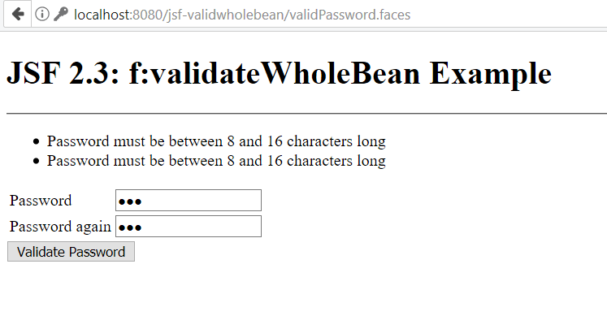
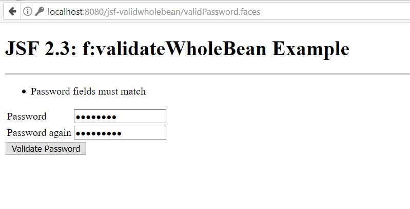

# Class level bean validation with f:valdiateWholeBean

JSF provides a `f:validateBean` which bridges Bean Validation to JSF, why we need another `f:validateWholeBean`?

This is explained in details in the [VDL docs](https://javaserverfaces.github.io/docs/2.3/vdldoc/index.html) of `f:validateWholeBean`.

> Support multi-field validation by enabling class-level bean validation on CDI based backing beans. This feature causes a temporary copy of the bean referenced by the value attribute, for the sole purpose of populating the bean with field values already validated by  and then performing class-level validation on the copy. Regardless of the result of the class-level validation, the copy is discarded.

in another word, it provides the capability of cross fields validation.

A good example is password matching check in a signup page, we have to make sure the values in password field and password confirm field are equivalent.

Create a bean validation annotation `@Password`.

```java
@Constraint(validatedBy=PasswordValidator.class)
@Target(TYPE)
@Retention(RUNTIME)
@interface Password {

    String message() default "Password fields must match";
    Class[] groups() default {};
    Class[] payload() default {};
}
```

`Constraint` declares which validator will handle this annotation, here it is `PasswordValidator`.

```java
public class PasswordValidator implements ConstraintValidator<Password, PasswordHolder> {

  @Override
  public void initialize(Password constraintAnnotation) { }

  @Override
  public boolean isValid(PasswordHolder value, ConstraintValidatorContext context) {
    boolean result;

    result = value.getPassword1().equals(value.getPassword2());

    return result;
  }

}
```

`ConstraintValidator` accept two parameters, the validator annotation, and the type\(`PasswordHolder`\) will be applied.

`PasswordHolder` is an interface which holds the values of two password fields.

```java
public interface PasswordHolder {

    String getPassword1();
    String getPassword2();  
}
```

Create a backing bean to put all together.

```java
@Named
@RequestScoped
@Password(groups = PasswordValidationGroup.class)
public class BackingBean implements PasswordHolder, Cloneable {

    private String password1;

    private String password2;

    public BackingBean() {
        password1 = "";
        password2 = "";
    }

    @Override
    protected Object clone() throws CloneNotSupportedException {
        BackingBean other = (BackingBean) super.clone();
        other.setPassword1(this.getPassword1());
        other.setPassword2(this.getPassword2());
        return other;
    }

    @NotNull(groups = PasswordValidationGroup.class)
    @Size(max = 16, min = 8, message = "Password must be between 8 and 16 characters long",
            groups = PasswordValidationGroup.class)
    @Override
    public String getPassword1() {
        return password1;
    }

    public void setPassword1(String password1) {
        this.password1 = password1;
    }

    @NotNull(groups = PasswordValidationGroup.class)
    @Size(max = 16, min = 8, message = "Password must be between 8 and 16 characters long",
            groups = PasswordValidationGroup.class)
    @Override
    public String getPassword2() {
        return password2;
    }

    public void setPassword2(String password2) {
        this.password2 = password2;
    }

}
```

We apply `Password` validation on the `backingBean`, it is a class level validation.

Create a simple facelets template.

```markup
<h:panelGroup id="messageFromInputBox">
    <h:messages />
</h:panelGroup>
<h:form>
    <h:panelGrid columns="2">

        <h:outputText value="Password" />  
        <h:inputSecret id="password1" value='#{backingBean.password1}' required="true">
            <f:validateBean validationGroups="javax.validation.groups.Default,com.hantsylabs.example.ee8.jsf.PasswordValidationGroup" />
        </h:inputSecret>

        <h:outputText value="Password again" /> 
        <h:inputSecret id="password2" value='#{backingBean.password2}' rendered="true">
            <f:validateBean validationGroups="javax.validation.groups.Default,com.hantsylabs.example.ee8.jsf.PasswordValidationGroup" />
        </h:inputSecret>

    </h:panelGrid>

    <f:validateWholeBean value='#{backingBean}' 
                         validationGroups="com.hantsylabs.example.ee8.jsf.PasswordValidationGroup" />
    <div>
        <h:commandButton 
            id="validtePassword" 
            value="Validate Password">
            <f:ajax execute="@form" render=":messageFromInputBox" />
        </h:commandButton>
    </div>
</h:form>
```

`f:validateWholeBean` accept a `value` attribute to set the backing bean.

**NOTE**, we use a `PasswordValidationGroup` group to differentiate varied validations.

`PasswordValidationGroup` is just an interface.

```java
public interface PasswordValidationGroup {

}
```

Run the project on Glassfish v5, open your browser and navigate to [http://localhost:8080/jsf-validwholebean/](http://localhost:8080/jsf-validwholebean/).

Try to input passwords, if its length is less than 8, submit form, it will display erros like.



If the length is valid, and the two password are not matched, it will trigger the `@Password` validator.



Grab the [source codes](https://github.com/hantsy/ee8-sandbox) from my GitHub account, and have a try.

